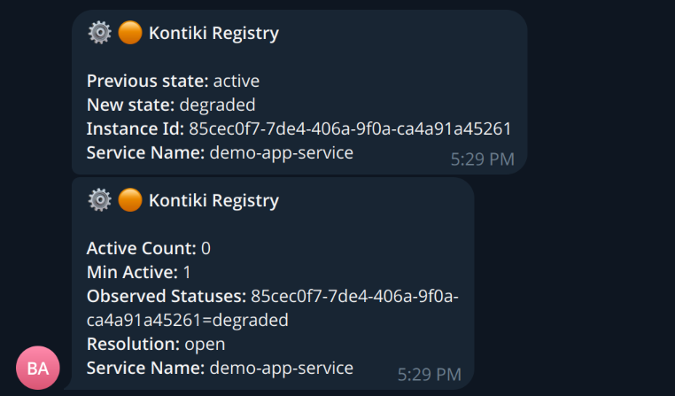

# kontiki-monitor

A small, practical ops suite for Kontiki platforms — complete enough to run, simple enough to own.

- **One complete ops loop** — Build on Kontiki, observe with kontiki-tui, get alerted through Boomerang. No patchwork of tools to glue together.
- **Alerts that matter from day one** — Fleet gaps, bad service state, full disks: signals your team can act on immediately.
- **Platform-native, low overhead** — Built on the Registry and the bus you already run. Same `alert.normalized` contract, fewer moving parts, production-ready without an observability army.

This repository ships two Kontiki services that plug into Boomerang: they judge Registry
fleet state, registry bus events, and local disk occupation, then publish
`alert.normalized` for subscriptions and notifiers.

| Service | CLI | Config | Role |
|---|---|---|---|
| `kontiki-monitor` | `kontiki-monitor` | `kontiki-monitor:` in `config/default.yaml` (+ `config/embedded.yaml`) | Fleet expectations and Registry bus events → alerts |
| `host-check-service` | `host-check-service` | `host-check:` in `config/host-check.yaml` | Local disk occupation (warning/critical %, paths); one instance per host |

### Where it shines

This suite fits best when the platform **is** Kontiki (plus maybe a thin UI), the team is
small, and the same stack must be **deployed and supported many times** — including
on-premise at customer sites. You get run / see / get-alerted without standing up a
separate observability plant on every install. Reach for heavier tooling when you need
cross-stack SLOs, deep performance forensics, or org-wide metrics at scale — not as the
default for operating Kontiki services day to day.

---

## Quickstart — demo-app → Telegram

The embedded stack runs Registry, **kontiki-monitor**, Boomerang (subscription / alert-engine /
notifiers), a demo app, and MailHog. Degrade the demo app; ops get a Telegram (and email) alert.

**1. Telegram bot token** (optional but needed for Telegram):

```bash
cp stack/telegram_notifier_bot_token.yaml.example \
   stack/telegram_notifier_bot_token.yaml
# set app.telegram.bot_token from BotFather
```

**2. Start the stack:**

```bash
make stack-up
```

**3. Target a chat** — operator config already wired for `demo-app-service` degraded:

```yaml
# stack/subscription.yaml (excerpt)
app:
  subscriptions:
    platform-ops:          # owner_id → recipient_id at dispatch
      demo-app-degraded:   # rule_name (subscription id under that owner)
        status: active
        subscription:
          rule:
            category: kontiki.registry
            event_type: instance_state_changed
            criteria:
              all_of:
                - key: service_name
                  operator: eq
                  value: demo-app-service
                - key: new_state
                  operator: eq
                  value: degraded
          endpoints:
            - telegram.ops_alerts   # <channel>.<endpoint_id> → telegram_notifier endpoints.ops_alerts
            - email.oncall         # <channel>.<endpoint_id> → email_notifier endpoints.oncall
```

```yaml
# stack/telegram_notifier.yaml (excerpt)
app:
  endpoints:
    ops_alerts:
      chat_id: "YOUR_CHAT_ID"
```

Fleet expectation for the demo (monitor opens/recovers `insufficient` / `missing` as well):

```yaml
# config/embedded.yaml (excerpt)
kontiki-monitor:
  expected_services:
    demo-app-service:
      min_active: 1
```

**4. Trigger an alert:**

```bash
make demo-app-degrade
# wait a few seconds (demo heartbeat is 5s)
```

Telegram looks like this:

<p align="center">
  
</p>

Email lands in MailHog: `http://127.0.0.1:8025`.

Recover and stop:

```bash
make demo-app-recover
make stack-down
```

---

## Local install

```bash
poetry install
```

## Integration tests

```bash
make run-amqp
make integration-test
```

Do not use Boomerang `make run-dev-platform` for these tests: it starts a real Registry and conflicts with the mock.
