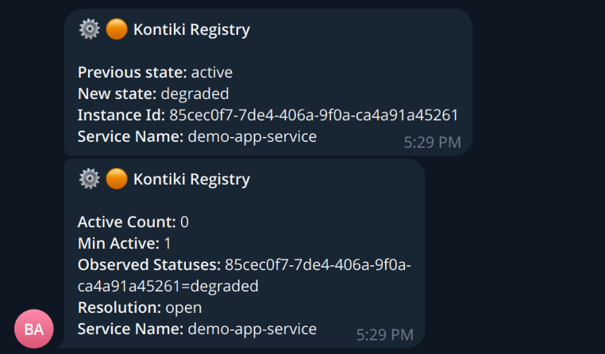

# kontiki-monitor

> **Part of the Kontiki suite** — a compact open-source stack for startups and
> small teams that need ops without the heavy stack.
>
> Full suite overview → https://kontiki-org.github.io/


Kontiki-monitor watches a Kontiki platform and raises alerts.
[Boomerang](https://github.com/kontiki-org/boomerang) delivers them (email, Telegram, …).

## What it watches

**Fleet.** Declare which services must be up, and how many active instances each one needs. An alert opens when a service is missing or short of that count, and recovers when the fleet is back.

**Lifecycle.** An alert each time an instance registers, leaves, or changes state (degraded, down, back to active).

**Exceptions.** The first time the Registry records an exception, an alert opens. Repeats of the same exception stay quiet. After a quiet period, the alert recovers.

**Sentinel.** An optional heartbeat POST to an external dead-man switch, sent only after Registry `get_services` returns. Three failed posts in a row open `sentinel_unreachable`. A successful post recovers it.

**Disk.** `host-check-service` watches usage on the paths you choose: warning, then critical, and a recovery once usage drops. One instance per host.

Alerts for a service can be silenced; silences are kept across restarts. Open alerts can be listed.

| Service | Image |
|---|---|
| [kontiki-monitor](src/kontiki_monitor/README.md) | `ghcr.io/kontiki-org/kontiki-monitor:1.0.0` |
| [host-check-service](src/kontiki_host_check/README.md) | `ghcr.io/kontiki-org/host-check-service:1.0.0` |

Those images run the two daemons. `pip install kontiki-monitor` installs the same commands.

Boomerang runs from its own images. [`boomerang-contracts`](https://pypi.org/project/boomerang-contracts/) is a `pip install` for code that emits alerts.

Keys and a full example: [docs/configuration.md](docs/configuration.md), [docs/kontiki-monitor-config.example.yaml](docs/kontiki-monitor-config.example.yaml).

Each process takes one or more `--config` YAML files. Boomerang’s own keys: [its configuration](https://github.com/kontiki-org/boomerang/blob/main/docs/configuration.md).

```bash
kontiki-monitor --config /path/to/monitor.yaml
host-check-service --config /path/to/host-check.yaml
```

A Registry and an AMQP broker sit beside them, as for any other Kontiki service.

## Try it

Docker Compose runs a demo app, the monitor, Boomerang, and a local mailbox (MailHog on `http://127.0.0.1:8025`). Telegram is optional: [bot token and chat id](docs/DEPLOYMENT_EMBEDDED.md#telegram).

```bash
make stack-up
make demo-app-degrade
```

<p align="center">
  
</p>

```bash
make demo-app-recover
make stack-down
```

What the stack runs, and how to point it at your own chat: [docs/DEPLOYMENT_EMBEDDED.md](docs/DEPLOYMENT_EMBEDDED.md).
